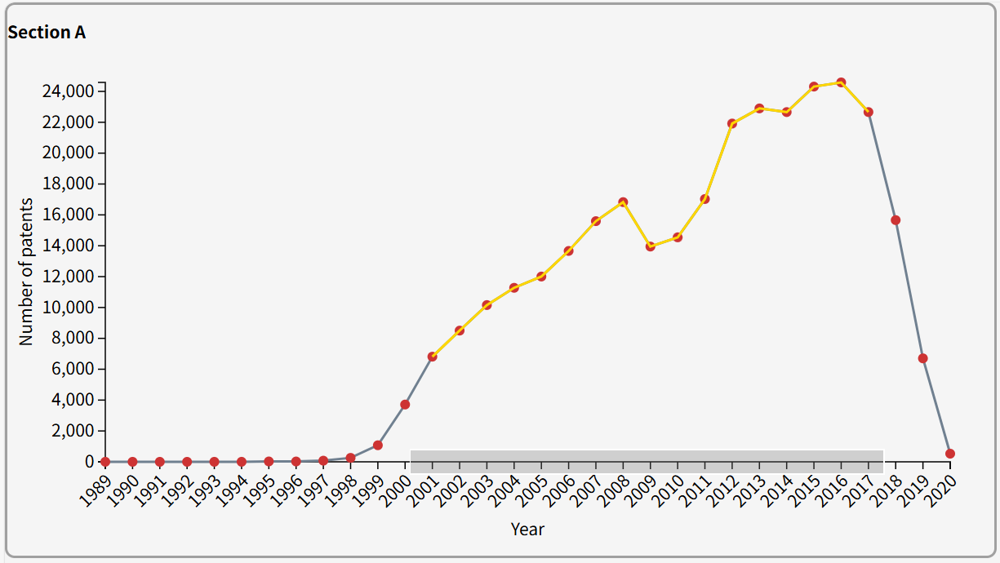
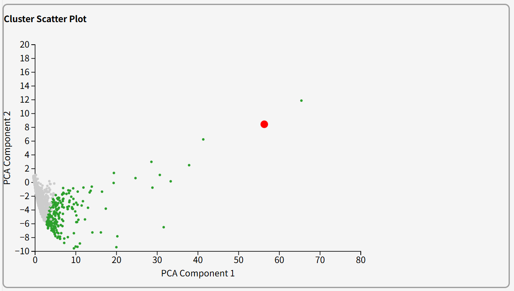
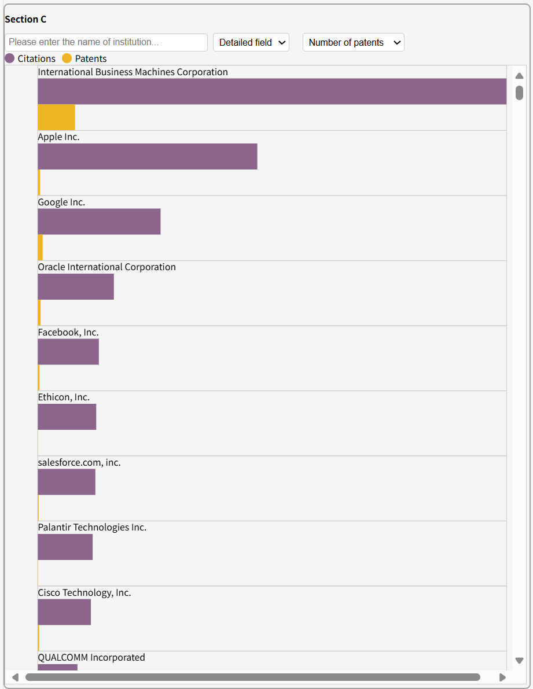
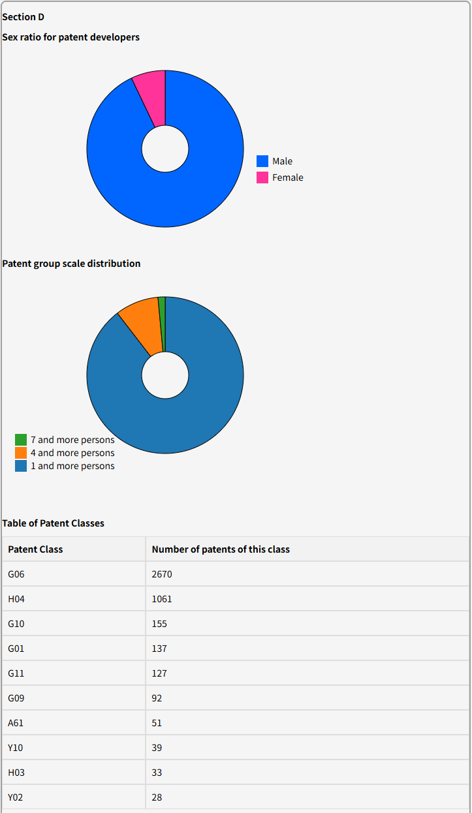
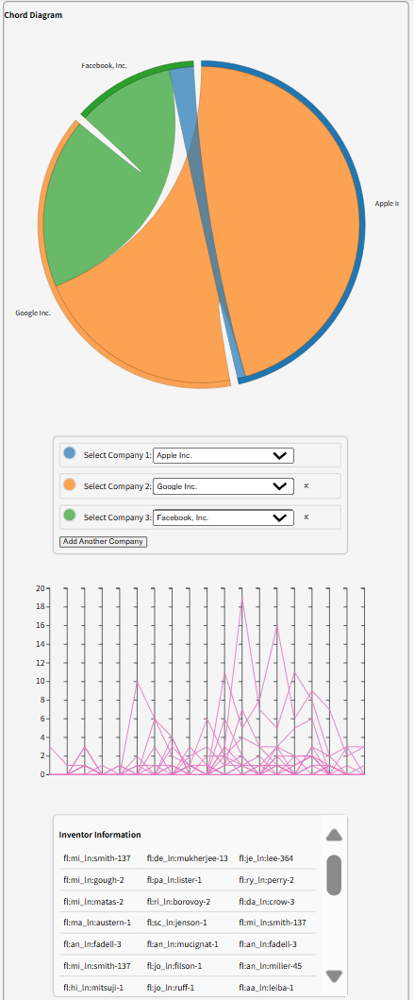

# Visualizing Career Development Insights through Patent Data
This repository contains the final project for the *Data Visualization* course (ARTS1422) at ShanghaiTech University.  
We selected **THEME ONE – Topic 2: Career Development** from the course project topics.

## Project Overview
Patent data reflects innovation, talent flow, and institutional strength.  
In this project, we explored how research institutions invest in innovation, how talent flows across organizations, and what impact it has on research output.  
We aim to answer the following key questions through visualization:

1. What are the research patterns and investment levels of different institutions?
2. How does talent mobility affect innovation outcomes?
3. What career planning insights can be derived for job seekers?

## Dataset
We used a cleaned version of the US patent data (1989–2020), including ~890,000 records.  
Key columns used include:
- `original_organization`
- `inventor_id`
- `male_flag`
- `cpc_class`, `cpc_sub_class`, `cpc_class_title`
- `filing_date`
- `beCited`

Each entry corresponds to one inventor's involvement in a patent filing. Some patents have multiple inventors, leading to repeated entries.

## Key Visualizations
We developed an interactive data visualization system with the following modules:
- **Technological Trends (Section A)**  
  A line chart illustrating the yearly number of patents, helping users identify periods of innovation booms and transitions across technological sectors.

- **Institutional Clustering Analysis (Section B)**  
  PCA (Principal Component Analysis) was used to reduce dimensionality of institution-level patent behaviors. The scatter plot highlights clusters of similar research patterns and identifies outlier organizations.

- **Institutional Comparison (Section C)**  
  A dynamic bar chart compares top companies (e.g., IBM, Apple, Google) in terms of patent counts and citation frequencies across detailed technology fields. Users can filter by field and metric.

- **Gender and Collaboration Analysis (Section D)**  
  Donut charts visualize the gender ratio of inventors and team size distribution. A summary table ranks patent subclasses by number of patents.

- **Talent Mobility Network (Section E)**  
  A chord diagram displays mobility of inventors between companies (e.g., Apple ↔ Google ↔ Facebook), paired with a time series showing collaboration intensity and a dynamic table of inventor details.

These modules provide a comprehensive understanding of institutional investment, individual contributions, and talent flows in the U.S. patent landscape from 1989 to 2020.

## Technologies Used
- **Frontend**: D3.js, HTML
- **Backend**: Python
- **Data Processing**: Pandas, NumPy
- **Visualizing Design**: line charts, scatter plots, bar charts, chord diagrams, and data tables

## File Structure
```plaintext
machine-learning-project/
│
├── code/                      # Python and D3 source code
├── PPT/                       # Final presentation (PPTX)
├── screenshots/               # Visual highlights
└── README.md                  # Project introduction
```

## Screenshots Preview
### Section A: Technological Trend


### Section B: Institutional Clustering


### Section C: Company Comparison


### Section D: Gender and Team Structure


### Section E: Talent Mobility Network

